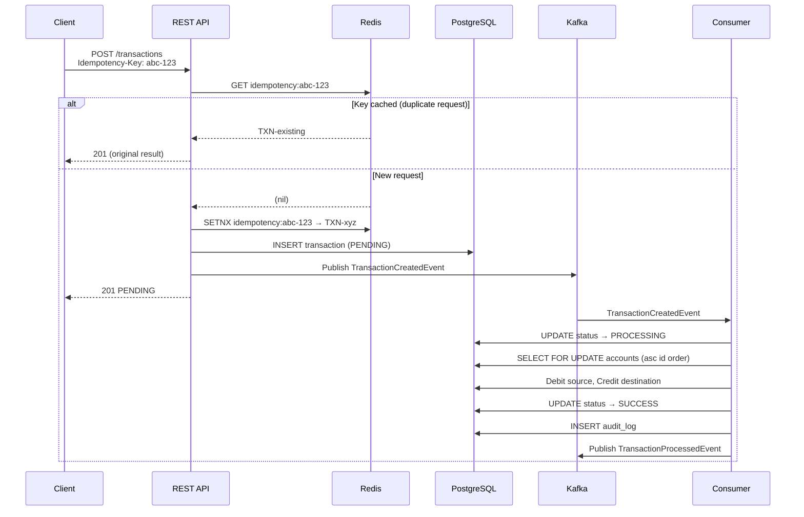
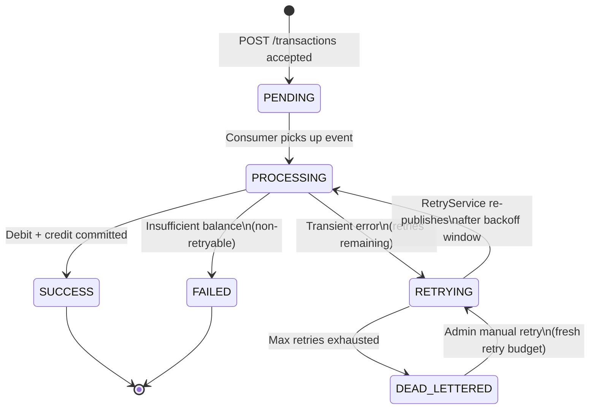

# Real-Time Transaction Processing System

[](https://github.com/thor-51/transaction-processing-system/actions/workflows/ci.yml)

A production-style, event-driven payment transfer platform built with Java 21 and Spring Boot 3. Transfers are accepted synchronously through a REST API, published to Kafka, and processed asynchronously by a consumer that debits the source account and credits the destination — with Redis-backed idempotency, exponential-backoff retry, dead-lettering, Prometheus/Grafana observability, and structured JSON logging ready for ELK ingestion.

---

## Table of Contents

1. [Architecture Overview](#architecture-overview)
2. [Tech Stack](#tech-stack)
3. [Features](#features)
4. [Event Flow](#event-flow)
5. [Transaction Lifecycle](#transaction-lifecycle)
6. [Folder Structure](#folder-structure)
7. [API Reference](#api-reference)
8. [Running Locally](#running-locally)
9. [Running Tests](#running-tests)
10. [Observability — Prometheus & Grafana](#observability)
11. [Idempotency](#idempotency)
12. [Retry & Dead-Lettering](#retry--dead-lettering)
13. [Load & Benchmarking](#load--benchmarking)
14. [New Relic Integration](#new-relic-integration)
15. [Resume Bullet Suggestions](#resume-bullet-suggestions)

---

## Architecture Overview

```
Client
  │
  │  POST /api/v1/transactions
  │  Idempotency-Key: <uuid>
  ▼
┌─────────────────────────────────────────────┐
│              Spring Boot App                │
│                                             │
│  TransactionController                      │
│       │                                     │
│       ▼                                     │
│  TransactionService                         │
│    ├─ IdempotencyService (Redis SETNX)      │
│    ├─ Validate (ownership, currency, amount)│
│    ├─ Persist PENDING row (Postgres)        │
│    └─ Publish TransactionCreatedEvent       │
│              │                              │
│              ▼                              │
│         Kafka Producer ──────────────────── ┼──▶ topic: transaction.created
│                                             │
│  TransactionEventConsumer ◀───────────────  ┼──  topic: transaction.created
│       │                                     │
│       ▼                                     │
│  TransactionProcessingService               │
│    ├─ Lock accounts (SELECT FOR UPDATE,     │
│    │   ascending-UUID order)                │
│    ├─ Debit source, Credit destination      │
│    ├─ Mark SUCCESS / RETRYING / FAILED      │
│    ├─ Write AuditLog                        │
│    └─ Publish outcome event                 │
│                                             │
│  RetryService (scheduled sweep)             │
│    └─ Re-publish RETRYING transactions      │
│       after exponential backoff window      │
└─────────────────────────────────────────────┘
         │               │              │
         ▼               ▼              ▼
    Postgres           Redis          Kafka
   (entities,      (idempotency    (topics:
    audit logs)     key TTL)    created/processed/
                               failed/dead-letter)
```

The synchronous API path only writes one database row and publishes one Kafka message — it never touches account balances. That critical section lives exclusively in the Kafka consumer, where it can be retried safely without re-running the HTTP request. This keeps the API's response time predictable regardless of how long the actual money movement takes.

---

## Tech Stack

| Layer | Technology |
|---|---|
| Language | Java 21 |
| Framework | Spring Boot 3.3 |
| API | Spring Web MVC, SpringDoc OpenAPI 2.x |
| Security | Spring Security, JJWT 0.12 (self-issued JWT) |
| Persistence | Spring Data JPA, Hibernate, PostgreSQL 16 |
| Migrations | Flyway |
| Messaging | Apache Kafka 7.7 (KRaft mode, no ZooKeeper) |
| Caching / Idempotency | Redis 7 |
| Observability | Micrometer + Prometheus + Grafana |
| Logging | Logback + logstash-logback-encoder (JSON) |
| APM (optional) | New Relic Java agent |
| Testing | JUnit 5, Mockito, Testcontainers |
| Build | Maven 3.9 |
| Runtime | Docker, Docker Compose |

---

## Features

- **JWT Authentication** — register and login; roles USER and ADMIN enforced at both URL-pattern and method level.
- **Account management** — create accounts with a currency and optional initial balance.
- **Transaction API** — create transfers with full validation (ownership, currency match, source ≠ destination, amount > 0).
- **Idempotency** — `Idempotency-Key` header with Redis-backed SETNX atomics prevents duplicate processing even under concurrent retries.
- **Async Kafka processing** — Kafka consumer handles all balance mutations; manual offset commit (MANUAL_IMMEDIATE ack mode) prevents data loss on crash.
- **Deadlock-safe account locking** — pessimistic row locks acquired in ascending UUID order regardless of transfer direction.
- **Retry with exponential backoff** — transient failures schedule RETRYING status; a scheduled sweep re-publishes when the backoff window elapses.
- **Dead-lettering** — exhausted retries produce DEAD_LETTERED status and a message on `transaction.dead-letter`.
- **Audit trail** — append-only `audit_logs` table records every lifecycle transition.
- **Prometheus metrics** — throughput, latency percentiles, outcome counters, retry rate, per-status gauges, JVM metrics.
- **Grafana dashboard** — auto-provisioned; open at http://localhost:3000 after `docker compose up`.
- **Structured JSON logging** — every log line carries `correlationId`, `application`, level, logger, and thread; ready for Logstash/Filebeat without a grok parser.
- **Admin endpoints** — list FAILED/DEAD_LETTERED transactions, view status counts, manually retry any failed transaction.
- **Swagger UI** — full OpenAPI docs at http://localhost:8080/swagger-ui.html.

---

## Event Flow



---

## Transaction Lifecycle



**Status semantics:**

| Status | Terminal | Meaning |
|---|---|---|
| PENDING | No | Created, waiting for consumer |
| PROCESSING | No | Consumer actively processing |
| SUCCESS | Yes | Funds moved |
| FAILED | Yes | Non-retryable failure (e.g. insufficient balance) |
| RETRYING | No | Transient failure, backoff timer running |
| DEAD_LETTERED | Yes | Max retries exhausted; needs admin review |

---

## Folder Structure

```
transaction-processing-system/
├── pom.xml                         # Maven build + dependency management
├── Dockerfile                      # Multi-stage build (Maven → JRE)
├── docker-compose.yml              # Full local stack
├── .env.example                    # Document all environment variables
├── docs/
│   └── NEW_RELIC.md                # APM agent integration guide
├── docker/
│   ├── prometheus/prometheus.yml   # Scrape config (app:8080/actuator/prometheus)
│   ├── grafana/
│   │   ├── provisioning/           # Auto-loaded datasource + dashboard pointers
│   │   └── dashboards/             # transaction-processing-dashboard.json (9 panels)
│   └── elk/logstash.conf           # Tails app JSON log, ships to Elasticsearch
└── src/
    ├── main/
    │   ├── java/com/example/transactionprocessing/
    │   │   ├── TransactionProcessingSystemApplication.java
    │   │   ├── config/             # Kafka topics/producer/consumer, Redis, OpenAPI, Web, RetryProperties, DevDataSeeder
    │   │   ├── security/           # JWT filter chain, token provider, access denied handlers
    │   │   ├── auth/               # Register/login controller + service + DTOs
    │   │   ├── user/               # User entity + repository
    │   │   ├── account/            # Account entity, repository, service, controller, DTOs, mapper
    │   │   ├── transaction/
    │   │   │   ├── entity/         # Transaction, TransactionStatus
    │   │   │   ├── repository/     # TransactionRepository (+ findByIdForUpdate)
    │   │   │   ├── service/        # TransactionService, TransactionProcessingService,
    │   │   │   │                   # IdempotencyService, RetryService, CreateTransactionCommand
    │   │   │   ├── event/          # TransactionCreatedEvent, ProcessedEvent, FailedEvent
    │   │   │   ├── producer/       # TransactionEventProducer
    │   │   │   ├── consumer/       # TransactionEventConsumer
    │   │   │   ├── controller/     # TransactionController, AdminTransactionController
    │   │   │   ├── dto/            # CreateTransactionRequest, TransactionResponse
    │   │   │   └── mapper/         # TransactionMapper (MapStruct)
    │   │   ├── audit/              # AuditLog entity, repository, AuditService
    │   │   ├── metrics/            # TransactionMetrics (Micrometer counters + timers + gauges)
    │   │   └── common/
    │   │       ├── entity/         # BaseEntity (UUID PK + audit timestamps)
    │   │       ├── exception/      # 8 domain exceptions + GlobalExceptionHandler
    │   │       ├── logging/        # CorrelationIdFilter (MDC request tracing)
    │   │       └── response/       # ApiResponse<T> envelope
    │   └── resources/
    │       ├── application.yml     # Shared config (all profiles)
    │       ├── application-dev.yml # Dev overrides (SQL logging, seed admin)
    │       ├── application-test.yml# Test fallback values (overridden by @DynamicPropertySource)
    │       ├── logback-spring.xml  # Human-readable in dev, JSON elsewhere + always-on file appender
    │       └── db/migration/       # V1 users → V2 accounts → V3 transactions → V4 audit_logs → V5 indexes
    └── test/
        ├── java/                   # 7 test classes (40 tests total — see Part 7)
        └── resources/
            └── application-test.yml # Disables Redis auto-config for @WebMvcTest slices
```

---

## API Reference

All responses share the envelope:
```json
{ "success": true/false, "data": { ... }, "error": { "code": "...", "message": "..." }, "timestamp": "..." }
```

### Authentication

#### Register
```bash
curl -X POST http://localhost:8080/api/v1/auth/register \
  -H "Content-Type: application/json" \
  -d '{"name":"Ada Lovelace","email":"ada@example.com","password":"Passw0rd!"}'
```

#### Login
```bash
curl -X POST http://localhost:8080/api/v1/auth/login \
  -H "Content-Type: application/json" \
  -d '{"email":"ada@example.com","password":"Passw0rd!"}'
```
Response includes `accessToken`; pass it as `Authorization: Bearer <token>` on all subsequent calls.

---

### Accounts

#### Create account
```bash
curl -X POST http://localhost:8080/api/v1/accounts \
  -H "Authorization: Bearer $TOKEN" \
  -H "Content-Type: application/json" \
  -d '{"currency":"INR","initialBalance":50000.00}'
```

#### List my accounts
```bash
curl http://localhost:8080/api/v1/accounts \
  -H "Authorization: Bearer $TOKEN"
```

#### Get single account
```bash
curl http://localhost:8080/api/v1/accounts/<account-id> \
  -H "Authorization: Bearer $TOKEN"
```

---

### Transactions

#### Create transfer (with idempotency)
```bash
curl -X POST http://localhost:8080/api/v1/transactions \
  -H "Authorization: Bearer $TOKEN" \
  -H "Content-Type: application/json" \
  -H "Idempotency-Key: $(uuidgen)" \
  -d '{
    "sourceAccountId": "<source-account-id>",
    "destinationAccountId": "<destination-account-id>",
    "amount": 500.00,
    "currency": "INR"
  }'
```

#### Get by ID
```bash
curl http://localhost:8080/api/v1/transactions/<transaction-id> \
  -H "Authorization: Bearer $TOKEN"
```

#### Get by reference
```bash
curl http://localhost:8080/api/v1/transactions/reference/TXN-abc123 \
  -H "Authorization: Bearer $TOKEN"
```

#### List (pageable)
```bash
curl "http://localhost:8080/api/v1/transactions?page=0&size=20&sort=createdAt,desc" \
  -H "Authorization: Bearer $TOKEN"
```

#### Manual retry (ADMIN only)
```bash
curl -X POST http://localhost:8080/api/v1/transactions/<id>/retry \
  -H "Authorization: Bearer $ADMIN_TOKEN"
```

---

### Admin Endpoints

First log in as the seeded dev admin (`admin@tps.local` / `Admin@12345`):
```bash
ADMIN_TOKEN=$(curl -s -X POST http://localhost:8080/api/v1/auth/login \
  -H "Content-Type: application/json" \
  -d '{"email":"admin@tps.local","password":"Admin@12345"}' \
  | python3 -c "import sys,json; print(json.load(sys.stdin)['data']['accessToken'])")
```

#### List failed transactions
```bash
curl http://localhost:8080/api/v1/admin/transactions/failed \
  -H "Authorization: Bearer $ADMIN_TOKEN"
```

#### List dead-lettered transactions
```bash
curl http://localhost:8080/api/v1/admin/transactions/dead-lettered \
  -H "Authorization: Bearer $ADMIN_TOKEN"
```

#### Metrics summary (counts by status)
```bash
curl http://localhost:8080/api/v1/admin/metrics/summary \
  -H "Authorization: Bearer $ADMIN_TOKEN"
```

---

## Running Locally

### Prerequisites

- Docker Engine 24+ and Docker Compose v2 (`docker compose version`)
- 4 GB of free RAM recommended (Kafka + Postgres + Redis + app + Grafana)
- Ports 8080, 5432, 6379, 9092, 9090, 3000, 8081 available

### 1. Clone and configure

```bash
git clone https://github.com/your-username/transaction-processing-system.git
cd transaction-processing-system
cp .env.example .env           # review and adjust if needed
```

### 2. Start the full stack

```bash
docker compose up -d --build
```

This starts: **app, postgres, redis, kafka, kafka-ui, prometheus, grafana**.

Watch the app come up:
```bash
docker compose logs -f app
```

The app is ready when you see:
```
Started TransactionProcessingSystemApplication in X.XXX seconds
```

### 3. Verify health

```bash
curl http://localhost:8080/actuator/health
# {"status":"UP", ...}
```

### 4. Open UIs

| Service | URL | Credentials |
|---|---|---|
| Swagger UI | http://localhost:8080/swagger-ui.html | — |
| Kafka UI | http://localhost:8081 | — |
| Grafana | http://localhost:3000 | admin / admin |
| Prometheus | http://localhost:9090 | — |

### 5. Quick smoke test

```bash
# Register
curl -s -X POST http://localhost:8080/api/v1/auth/register \
  -H "Content-Type: application/json" \
  -d '{"name":"Test User","email":"user@example.com","password":"Passw0rd!"}' | python3 -m json.tool

# Login and capture token
TOKEN=$(curl -s -X POST http://localhost:8080/api/v1/auth/login \
  -H "Content-Type: application/json" \
  -d '{"email":"user@example.com","password":"Passw0rd!"}' \
  | python3 -c "import sys,json; print(json.load(sys.stdin)['data']['accessToken'])")

# Create two accounts
SRC=$(curl -s -X POST http://localhost:8080/api/v1/accounts \
  -H "Authorization: Bearer $TOKEN" -H "Content-Type: application/json" \
  -d '{"currency":"INR","initialBalance":10000}' \
  | python3 -c "import sys,json; print(json.load(sys.stdin)['data']['id'])")

DST=$(curl -s -X POST http://localhost:8080/api/v1/accounts \
  -H "Authorization: Bearer $TOKEN" -H "Content-Type: application/json" \
  -d '{"currency":"INR","initialBalance":0}' \
  | python3 -c "import sys,json; print(json.load(sys.stdin)['data']['id'])")

# Send a transfer
curl -s -X POST http://localhost:8080/api/v1/transactions \
  -H "Authorization: Bearer $TOKEN" \
  -H "Content-Type: application/json" \
  -H "Idempotency-Key: smoke-test-001" \
  -d "{\"sourceAccountId\":\"$SRC\",\"destinationAccountId\":\"$DST\",\"amount\":500,\"currency\":\"INR\"}" \
  | python3 -m json.tool
```

### Optional: Start with ELK logging

The ELK stack (Elasticsearch, Logstash, Kibana) is gated behind a Docker Compose profile to keep the default footprint reasonable — it requires an extra ~1.5 GB RAM.

```bash
docker compose --profile elk up -d
```

Kibana becomes available at http://localhost:5601. Create an index pattern `transaction-processing-system-*` to explore the structured JSON logs.

### Stopping

```bash
docker compose down          # stop containers, keep volumes (data survives)
docker compose down -v       # stop and delete all volumes (clean slate)
```

---

## Running Tests

### Unit and slice tests (no Docker needed)

```bash
mvn test -Dspring.profiles.active=test
```

This runs all 7 test classes. The pure Mockito tests (`AuthServiceTest`, `TransactionServiceTest`, `IdempotencyServiceTest`, `TransactionConsumerTest`, `AccountLockingTest`) have zero infrastructure dependencies. The `@WebMvcTest` slice (`TransactionControllerIntegrationTest`) needs no external services either — Redis auto-config is suppressed in `src/test/resources/application-test.yml`.

### Integration tests (Testcontainers — Docker required)

`TransactionRepositoryTest` uses Testcontainers to spin up a real PostgreSQL container. Docker must be running:

```bash
mvn test -pl . -Dtest=TransactionRepositoryTest
```

Or run all tests including Testcontainers-backed ones:
```bash
mvn verify
```

Testcontainers pulls `postgres:16-alpine` on first run (~150 MB) and reuses it across subsequent runs.

### Run a specific test class

```bash
mvn test -Dtest=TransactionServiceTest
mvn test -Dtest=AccountLockingTest
```

### Coverage report

```bash
mvn verify -Pcoverage      # add jacoco plugin to pom.xml for HTML report at target/site/jacoco/
```

---

## Observability

### Prometheus metrics

The app exposes Micrometer metrics at:
```
GET http://localhost:8080/actuator/prometheus
```

Key custom metrics:

| Metric | Type | Description |
|---|---|---|
| `transaction_created_total` | Counter | Total transactions created via the API |
| `transaction_outcome_total{status="success"}` | Counter | Successful transfers |
| `transaction_outcome_total{status="failed"}` | Counter | Non-retryable failures |
| `transaction_outcome_total{status="dead_lettered"}` | Counter | Exhausted-retry failures |
| `transaction_retry_scheduled_total` | Counter | Retry attempts scheduled |
| `transaction_processing_duration_seconds` | Histogram | End-to-end latency (PENDING → terminal) |
| `transaction_status_count{status="..."}` | Gauge | Live DB count per status (6 labels) |

Plus the full standard Spring Boot / Micrometer set: `http_server_requests_seconds`, `jvm_memory_*`, `jvm_gc_*`, `hikaricp_*`, `kafka_producer_*`, etc.

### Grafana dashboard

The dashboard (`docker/grafana/dashboards/transaction-processing-dashboard.json`) is auto-provisioned by Grafana on startup — no manual import needed. Open http://localhost:3000 (admin / admin).

**9 panels:**
1. Transaction throughput (created/sec)
2. Outcomes by status (stacked, per sec)
3. Processing latency percentiles (p50 / p95 / p99)
4. Retry rate (retries/sec)
5. Success rate % (stat + threshold colouring)
6. Dead-lettered total (stat, red at ≥ 1)
7. Live transactions by status (horizontal bar gauge)
8. HTTP request rate by status code
9. JVM heap used

### Structured JSON logging

In all non-dev profiles (and always in the rolling file appender), every log line is a JSON object:
```json
{
  "@timestamp": "2025-09-15T10:23:44.123Z",
  "@version": "1",
  "message": "Transaction id=abc reference=TXN-xyz processed successfully",
  "logger_name": "com.example.transactionprocessing.transaction.service.TransactionProcessingService",
  "thread_name": "org.springframework.kafka.KafkaListenerEndpointContainer#0-0-C-1",
  "level": "INFO",
  "application": "transaction-processing-system",
  "correlationId": "7f3d9a2b-1c4e-4f8b-9d6a-2e5f1b3c7d9e"
}
```

`correlationId` is set by `CorrelationIdFilter` — every log line from the same HTTP request shares one id, so in Kibana you can filter `correlationId: <id>` to see the full trace for one request. Inbound `X-Correlation-Id` headers are honoured so upstream gateways can propagate their own trace ids.

---

## Idempotency

### Why it matters

Without idempotency, a client that retries a timed-out `POST /transactions` request may create two transfers for the same intended payment. This system prevents that.

### How it works

1. Client sends `Idempotency-Key: <client-generated-uuid>` with the request.
2. The API checks Redis for `idempotency:<key>`. If found, it returns the original transaction immediately — no validation, no new row, no Kafka publish.
3. If not found, it atomically claims the key with Redis `SETNX` (returns false if another concurrent request wins the race).
4. The winner persists the transaction and stores `idempotency:<key> → TXN-<ref>` in Redis with a 24-hour TTL.
5. The loser either gets the winner's already-committed result (happy path) or a 409 CONFLICT if the winner hasn't committed yet (client should retry in a moment).

The Postgres `transactions.idempotency_key` UNIQUE constraint is a backstop: if Redis is unavailable or a key is evicted before its TTL, the database constraint prevents silent duplicate inserts.

### Key properties

- **Safe to retry**: sending the same `Idempotency-Key` twice always returns the same result.
- **Concurrent-safe**: two simultaneous requests with the same key are serialised by the `SETNX` atomics.
- **Scope**: keys are scoped per authenticated user by design — the same key from two different users creates two independent transactions.
- **Expiry**: keys expire after 24 hours (configurable via `app.idempotency.ttl-hours`).

---

## Retry & Dead-Lettering

### Why not RabbitMQ?

The brief noted RabbitMQ as optional. This project uses Kafka's own topic model for retry/dead-letter instead, for two reasons: (1) there is already a Kafka broker in the stack, so a second message broker would add infrastructure cost without adding capability, and (2) Kafka's `transaction.dead-letter` topic gives you the same DLQ semantics with less operational complexity and a better message-replay story.

### Failure classification

| Exception type | Classification | Result |
|---|---|---|
| `InsufficientBalanceException` | Non-retryable | → FAILED immediately, no retries |
| Any other `Exception` | Retryable (transient) | → RETRYING, retry budget starts |

### Retry schedule (exponential backoff)

```
attempt 1 → wait  1 s   (initialBackoffMs = 1000)
attempt 2 → wait  2 s
attempt 3 → wait  4 s
attempt 4 → wait  8 s
attempt 5 → wait 16 s   (maxAttempts = 5)
              → DEAD_LETTERED
```

Formula: `min(initialBackoffMs × multiplier^(attempt−1), maxBackoffMs)`.  
All values are configurable in `application.yml` under `app.retry.*`.

### How retries work

1. `TransactionProcessingService` sets `status = RETRYING`, increments `retryCount`, and returns without re-publishing.
2. `RetryService` runs a scheduled sweep every 5 seconds.
3. For each RETRYING transaction, it computes the next-due timestamp from `updatedAt + backoff(retryCount)`.
4. Due transactions are re-published to `transaction.created` (the same topic as new transactions — no special processing path).
5. The consumer picks them up and calls `TransactionProcessingService.process()` again.

### Dead-letter handling

Once `retryCount >= maxAttempts`, the transaction becomes `DEAD_LETTERED` and a message is published to `transaction.dead-letter`. At that point:

- The funds have **not** moved — the source account balance is untouched.
- An admin can inspect it via `GET /api/v1/admin/transactions/dead-lettered`.
- After investigating the root cause, an admin can reset the retry budget and re-queue it via `POST /api/v1/transactions/<id>/retry`.
- This endpoint is `ADMIN`-only; it resets `retryCount = 0` and `status = RETRYING` so the standard backoff schedule restarts cleanly.

---

## Load & Benchmarking

### Target throughput

10,000 transactions/day = ~0.12 TPS sustained. The bottleneck at this scale is almost certainly Postgres write throughput (each transaction needs 2 account updates + 1 transaction update + 1 audit insert under a pessimistic lock), not Kafka or the app tier.

### Running a local benchmark with `hey`

Install [hey](https://github.com/rakyll/hey), then:

```bash
# 1. Set up accounts first (get TOKEN, SRC, DST as per the smoke test above)

# 2. Warm up (50 requests, single thread)
hey -n 50 -c 1 \
  -H "Authorization: Bearer $TOKEN" \
  -H "Content-Type: application/json" \
  -H "Idempotency-Key: warmup-$(uuidgen)" \
  -m POST \
  -d "{\"sourceAccountId\":\"$SRC\",\"destinationAccountId\":\"$DST\",\"amount\":1,\"currency\":\"INR\"}" \
  http://localhost:8080/api/v1/transactions

# 3. Sustained load (1000 requests, 10 concurrent — each with a unique key)
# hey doesn't support per-request headers; use k6 or a shell loop for unique keys:
for i in $(seq 1 1000); do
  curl -s -o /dev/null -X POST http://localhost:8080/api/v1/transactions \
    -H "Authorization: Bearer $TOKEN" \
    -H "Content-Type: application/json" \
    -H "Idempotency-Key: bench-$i" \
    -d "{\"sourceAccountId\":\"$SRC\",\"destinationAccountId\":\"$DST\",\"amount\":1,\"currency\":\"INR\"}" &
  [ $((i % 20)) -eq 0 ] && wait   # cap at 20 concurrent
done
wait
```

### What to watch in Grafana

- **Transaction throughput panel** — created/sec should match your send rate.
- **Latency p95/p99** — Kafka queue time + DB lock contention shows up here. Aim for p99 < 500 ms on a local machine.
- **Status count gauges** — PENDING backlog growing means the consumer is falling behind.
- **JVM heap** — watch for a sawtooth GC pattern; a flat heap that grows linearly suggests a memory leak.

### Scaling headroom

- **Kafka partitions**: `transaction.created` is created with 3 partitions by default. To scale horizontally, set `app.kafka.partitions` and start additional app instances — each gets a share of the partitions automatically.
- **Connection pool**: `DB_POOL_SIZE` defaults to 10. Under sustained high concurrency the lock-wait time on accounts becomes the primary bottleneck; pool size past ~20 buys little without also adjusting Postgres's `max_connections`.
- **Redis**: idempotency key throughput is typically not a bottleneck — a single Redis instance handles hundreds of thousands of SETNX operations per second.

---

## New Relic Integration

The agent jar is not bundled. See [`docs/NEW_RELIC.md`](docs/NEW_RELIC.md) for:

- What config hooks are already wired up (`application.yml`, `docker-compose.yml`, `Dockerfile`)
- Step-by-step local activation with Docker Compose (mount agent jar + set `JAVA_OPTS`)
- Why it complements rather than replaces Prometheus/Grafana (distributed traces vs. aggregate metrics)

---
